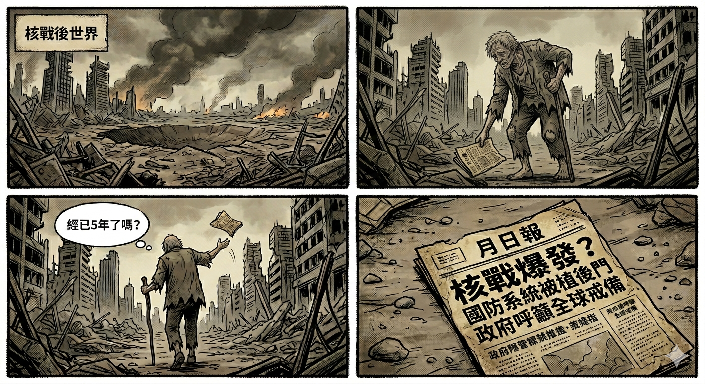

參加了資訊安全機構的[AI生成四格漫畫比賽](https://www.cybersecurity.hk/tc/contest-2026.php)。早前看了藤井樹的[驀然回首](https://zh.wikipedia.org/zh-tw/%E9%A9%80%E7%84%B6%E5%9B%9E%E9%A6%96_(%E6%BC%AB%E7%95%AB))，早已想躍躍欲試，終於有了死線的動力，更沒有籍口推說不懂畫畫。

花點時間寫幾個四格內容，太太無心聽到內容後也有興致拿一個參賽，在電腦前跟Gemini起勁聊起來。

故事交了兩個，還有一個便在這裡發表，留個記錄。

